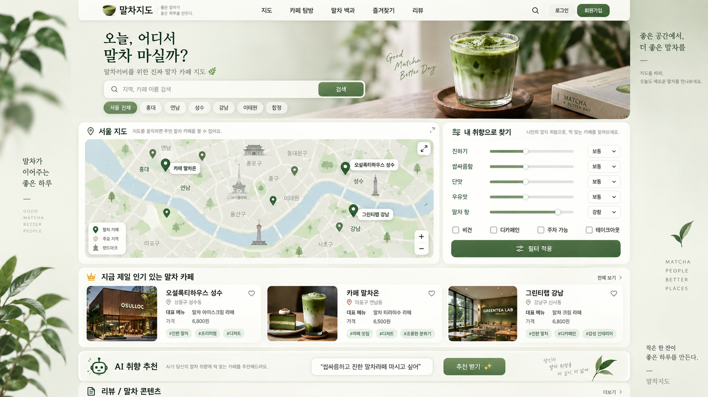

# 말차요정지도 — UI 구현 가이드

이 문서는 참고 이미지와 목표 화면 구성을 담당한다. 아래 화면 요소가 모두 구현되었다는 뜻은 아니며 실제 작업은 사용자의 요청 범위에 맞춘다.
참고 이미지의 문구·메뉴·AI 표시는 디자인 참고이며 별도 기능 구현 지시가 아니다.

- 제품 목적·확장 방향: [PROJECT_OVERVIEW](PROJECT_OVERVIEW.md)
- 현재 기능·동작 규칙·추가 후보: [FEATURES](FEATURES.md)
- 모델·제약조건: [DATA_MODEL](DATA_MODEL.md)
- 사용자 흐름: [USER_FLOW](USER_FLOW.md)
- 개발·검증 원칙: [CODING_RULES](CODING_RULES.md)

## 1. 참고 UI

메인 화면은 아래 참고 이미지를 디자인 기준으로 사용한다.



### 중요

참고 이미지를 픽셀 단위로 그대로 복제하는 것이 목적은 아니다.

현재 Django 프로젝트의 기존 기능을 유지하면서,

- 화면 구성
- 정보 배치
- 분위기
- 사용자 흐름

을 참고해서 구현한다.

### 전체 분위기

- 따뜻한 아이보리 배경
- 딥그린 포인트 컬러
- 자연스럽고 차분한 말차 브랜드 느낌
- 카드와 버튼은 부드러운 라운드 형태
- 너무 딱딱한 SaaS 스타일은 피하기
- 말차 카페를 찾아다니고 싶어지는 감성
- 데스크톱과 모바일 모두 사용하기 편하게 만들기

---

## 2. 메인 화면 구조

참고 UI 기준으로 메인 화면을 다음 순서로 구성한다.

### 상단 헤더

왼쪽:

- 말차요정지도 로고

메뉴:

- 홈
- 카페 목록
- 즐겨찾기
- 제보하기

오른쪽:

- 검색 아이콘
- 즐겨찾기 아이콘
- 로그인 사용자 영역

기존 회원가입·로그인 기능을 유지하고 재사용한다.

---

## 3. Hero 영역

메인 문구:

```text
오늘, 어디서 말차 마실까?
```

서브 문구:

```text
나만의 취향에 맞는 말차 카페를 찾아보세요.
```

검색 영역:

- 카페 이름 검색
- 지역 검색
- 지역 선택
- 검색 버튼

향후 글로벌 서비스 확장 시 국가 선택 기능을 추가하기 쉬운 구조로 만든다.

예:

```text
대한민국 / 일본 / 미국
```

---

## 4. 지도

현재 프로젝트에서 사용 중인 **Leaflet 지도 기능을 유지한다.**

카페 위치에 마커를 표시한다.

### 마커 클릭 시 표시

현재 팝업에서 다음 정보를 표시한다.

- 카페 대표 이미지
- 카페 이름
- 평점
- 리뷰 수
- 지역
- 대표 말차 메뉴
- 가격
- 상세보기 링크

### 중요한 동작

검색 또는 필터 조건이 바뀌면 지도 마커도 함께 변경되어야 한다.

즉,

```text
검색 결과
=
지도 마커
=
하단 카페 카드
```

가 동일한 검색·필터 결과를 기준으로 움직여야 한다.

단, 좌표가 없는 카페는 카드와 결과 수에는 포함하고 지도 마커에서만 제외한다.

---

## 5. 취향으로 찾기

참고 이미지처럼 지도 오른쪽에 **취향으로 찾기** 패널을 만든다.

### 말차 취향 항목

#### 말차 진하기

- 연함
- 보통
- 진함

#### 쓴맛

- 적음
- 보통
- 많음

#### 단맛

- 적음
- 보통
- 많음

#### 우유맛

- 적음
- 보통
- 많음

#### 말차 향

현재 맛 데이터와 입력은 1~5점이다. 필터의 이상·이하 기준 및 미입력 처리는 [FEATURES](FEATURES.md)를 따른다.
위의 3단계 표현은 목표 UI안이며, 점수 대응과 검색 조건은 구현 전에 정한다.
표시 예시 `1~2 / 3 / 4~5`를 자동으로 검색 범위 규칙으로 사용하지 않는다.

### 추가 옵션

- 디카페인
- 비건
- 주차 가능
- 테이크아웃

### 필터 동작

필터를 적용하면 아래 두 영역이 동시에 갱신되어야 한다.

```text
지도 마커
+
하단 카페 카드
```

`초기화` 버튼도 제공한다.

---

## 6. 카페 카드

지도 아래에는 검색 및 필터 결과를 카드 형태로 표시한다.

각 카드에는 다음 정보를 보여준다.

- 대표 이미지
- 카페 이름
- 지역
- 평점
- 리뷰 수
- 대표 말차 메뉴
- 가격
- 특징 태그
- 즐겨찾기 버튼

태그 예시:

```text
#진한말차
#디저트
#분위기
#연남동
```

카드 클릭 시 기존 카페 상세 페이지로 이동한다.

---

## 7. 즐겨찾기

사용자가 마음에 드는 카페를 저장할 수 있어야 한다.

### 기본 동작

- 카페 카드의 하트 버튼 클릭
- 즐겨찾기 추가 / 제거
- 헤더의 즐겨찾기 메뉴에서 저장한 카페 확인

기존 즐겨찾기 기능을 재사용한다.

---

## 8. 검색

목표 검색 동작은 다음과 같다. 현재 카페 이름·지역명 부분 검색과 정해진 지역의 정확 일치 필터를 지원한다.

- 카페 이름
- 지역

부분 일치 검색이 가능해야 한다.

예:

```text
"성수"
→ 성수 지역 카페 표시

"오설록"
→ 이름에 오설록이 포함된 카페 표시
```

검색어와 지역 필터를 동시에 사용할 수 있어야 한다.

---

## 9. 반응형 UI

데스크톱뿐 아니라 모바일도 고려한다.

### 데스크톱

참고 이미지처럼:

```text
지도 + 취향 필터 패널
```

형태로 배치한다.

### 모바일

화면이 좁아지면 다음처럼 세로 배치해도 된다.

```text
검색
↓
취향 필터
↓
지도
↓
카페 카드
```

모바일에서 가로 스크롤이 생기지 않도록 한다.

---

## 10. 구현 우선순위

우선순위는 다음과 같다.

```text
1. 기존 기능 유지
2. 실제 기능 동작
3. 검색 / 지도 / 필터 데이터 연결
4. 사용성
5. 참고 이미지에 가까운 UI
```

단순히 화면만 비슷하게 만드는 것은 목표가 아니다.

검색, 필터, 지도, 즐겨찾기가 실제 데이터와 연결되어 동작해야 한다.

---


## 메인 화면 적용 기록 (2026-09-20)

서비스 표시 이름을 말차요정지도로 통일했다. 아이보리·딥그린 색상, 말차 잔 SVG 일러스트, 카드와 반응형 배치를 적용했다. 모바일에서는 필터를 지도 앞에 배치한다. 검색과 추천 계산은 기존 규칙을 유지한다. 참고 이미지에 남아 있는 예전 이름은 사용하지 않는다.

## Hero 배너 관리 (2026-09-21)

관리자에서 Hero 이미지를 설정할 수 있다. 데스크톱은 기존 오른쪽 영역, 모바일은 문구 아래에 가로 이미지로 표시한다. 기본 비율 8:5, 모바일 16:9이며 cover로 채우고 정렬을 선택한다. 이미지 미등록 시 기존 SVG 일러스트를 표시한다. Hero 문구와 검색 동작은 유지한다.

## 통합 Hero 레이아웃 (2026-09-21)

문구·검색 폼·지역 필터를 Hero 내부 왼쪽에 배치하고 오른쪽 사진과 55:45로 구성한다. 공통 라운드 컨테이너와 경계 그라데이션으로 연결한다. 760px 이하에서는 문구 → 검색 → 지역 필터 → 사진 순이며 사진은 2:1, 최대 높이 260px이다. 검색 GET 파라미터와 URL은 유지한다. 스크린샷 배너 대신 실사풍 생성 이미지를 적용했으며 실제 촬영 사진은 아니다. 관리자 업로드와 일러스트 대체 기능은 유지한다.

이미지: `media/hero/matcha-latte-hero.png`. 내장 image_gen으로 제작. 프롬프트: Photorealistic lifestyle product photograph, iced matcha latte on a wooden coaster, warm sunlight, ivory wall and green leaves, drink slightly right of center, landscape 3:2, no text, logos, UI or screenshots.
